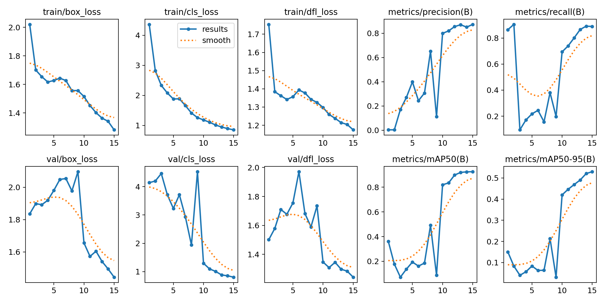
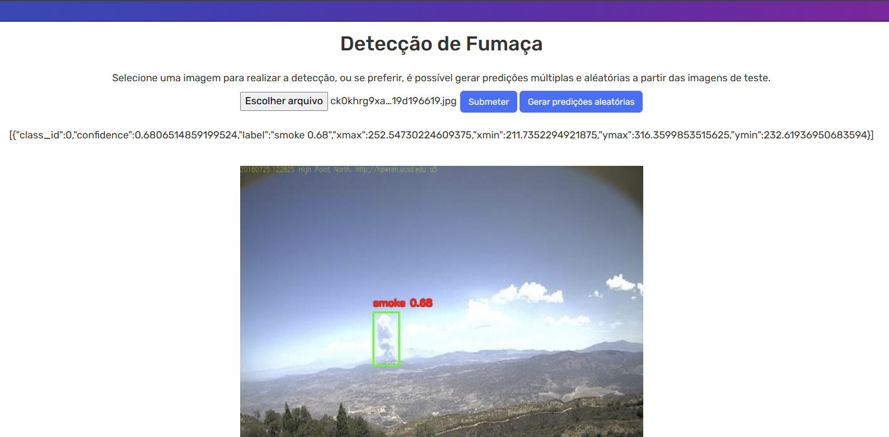

# Desafio Data Science 2025

Repositório contendo projeto end-to-end de detecção de fumaça para o desafio Data Science 1,5ºC

Neste repositório você encontrará:

- Notebook de investigação da solução proposta
- Pipeline de treinamento do modelo
- Pipeline de predição para imagens testes
- Aplicação em Flask para visualização dos resultados

O notebook que apresenta as linhas gerais de pensamento e fluxo de execução do treinamento do modelo se encontra em `notebooks/smoke_detection.ipynb`

A execução do projeto pode ser vista em ambiente de Google Colab, o colab foi necessário para a utilização de GPUs. O notebook, assim como o módulo importado pode ser encontrado no link:

https://colab.research.google.com/github/renneruan/desafio-data-science-2025/blob/main/notebooks/smoke_detection.ipynb

## Treinamento e ambiente

O Treinamento pode ser realizado novamente seguindo a disposição de células a partir do Google Colab.

Além disso, caso você possua placa de vídeo em sua máquina, o treinamento pode ser realizada a partir da execução do script `main.py`, porém antes é necessário instalar o ambiente de dependências.

Foi utilizado o pacote Anaconda, com ambiente em Python 3.11, e o ambiente Python criado foi dado pelos seguintes comandos:

```
# Dentro da pasta do projeto

conda create -n "smoke_detection" python=3.11
conda activate "smoke_detection"

pip install -r requirements.txt
```

Para executar o treinamento:

```
python main.py
```

## Execução da API

Para a execução da API e da aplicação de teste em Flask é necessário instalar as dependências e executar:

```
python app.py
```

## Estrutura do repositório

Para o pipeline a ser executado por `main.py` temos o módulo `smoke_detection` presente na pasta `src`

Ele irá conter as seguintes pastas:

- `constants`: Armazena informações de caminhos de diretórios
- `pipeline`
  - `prediction`: Possui funções necessárias para a ação de predição
  - `preprocessing`: Função para equalização do brilho das imagens
  - `train.py` Funções para o treinamento do modelo YOLO
- `utils`
  - `commons`: Funções auxiliares para criação e leitura de arquivos
  - `image_evaluation` Funções auxiliares para criação de imagens de avaliação manual.

## Métricas

As métricas do treinamento e avaliação em conjunto de teste foram discutidas no arquivo `notebooks/smoke_detection.ipynb`.

Obtivemos uma métrica de

- Precisão: 0.872
- Recall: 0.887
- mAP50: 0.928
- mAP50-95: 0.53
- Tempo de inferência: 4.5ms

Podemos visualizar os gráficos do treinamento gerados pelo YOLO:


## Previsões em imagens de teste

Após a execução da aplicação Flask o uso da API pode ser realizada pelo IP 0.0.0.0:8080 possuindo uma interface para o carregamento de uma imagem, além da possibilidade de previsão múltipla.

Foi criado dois endpoints

`/predict` em que é possível fazer o upload de uma imagem e receber a nova imagem com a predição realizada, além dos valores de bounding box e confiança.
`/predict_multiple` Em que é possível receber predições aleatórias das imagens presentes no conjunto de teste.

Imagem da interface criada com uma imagem de teste carregada para predição:


